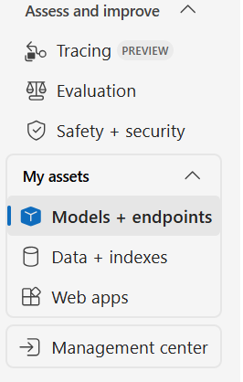
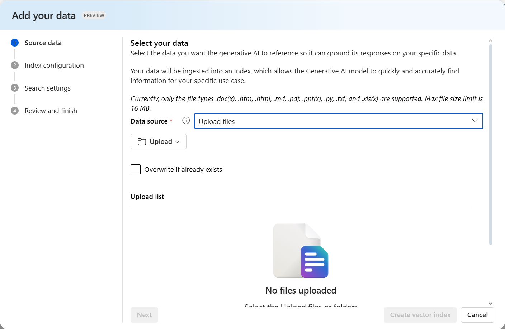
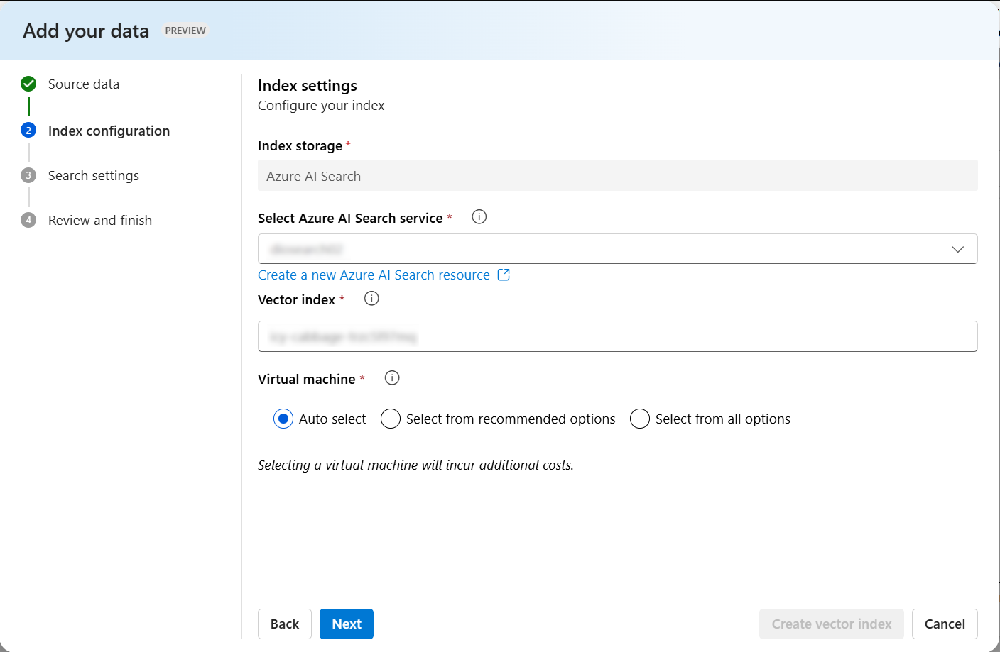
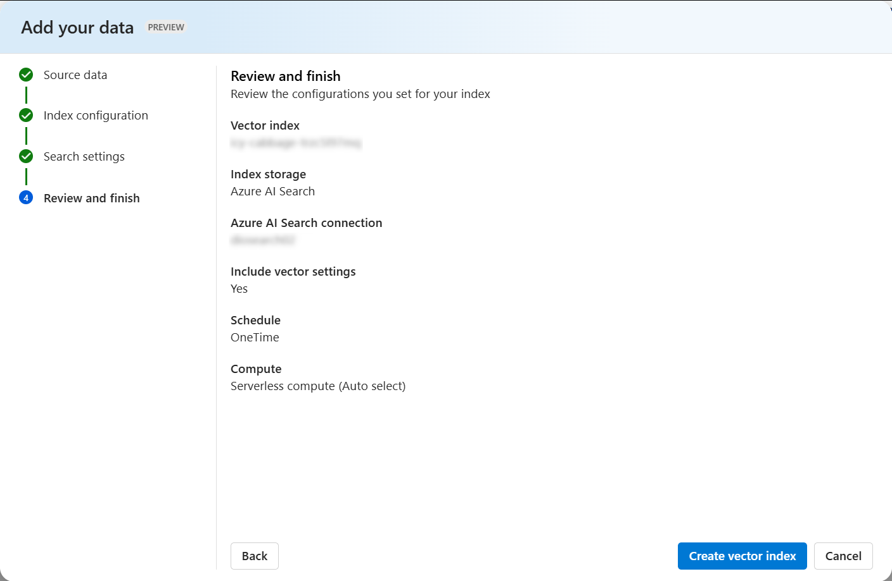

# Chatbot Based On PDF Documents using Azure AI Foundry

> Challenge created as part of the Microsoft Certification Challenge #3 DP-100 Bootcamp by DIO:

## Scenario
Imagine that you are a Software Engineering Student looking for your graduate thesis on human-machine interaction. It's necessary to revise and correlate a lot of papers and essays. Therefore, the more the document as harder is to extract relevant information and connect ideas between the different texts.

With this challenge, you decide to use AI to make this process easier by developing an intelligent search system to be able to interpret PDF files, organize information and generate relevant answers based on the loaded content.

## Goal

✅Load PDF files containing relevant information about the study or project.

✅Implement an embedded search system to index and retrieve information from PDF files.

✅Use AI to generate responses based on the content of the loaded documents.

✅Develop an interactive chatbot to ask questions and receive contextual answers based on the documents.

---

## 1. Setting the environment in Azure AI Foundry

### 1.1. Create a project in Azure AI Foundry portal

- Navigate to [Azure AI Froundry](https://ai.azure.com/).

- Create a project and new hub

- After the resources are created, you will be brought to your project’s Overview page. On the left-hand menu on the screen, select *Models + endpoints*.

<div align="center">
     
</div>
<div align="center">Models + endpoints</div>

### 1.2. Setting models in Azure AI Foundry portal

- In Azure AI Foundry’s Models + endpoints page, select **Deploy Model**. 

- Click in *deploy base model*. Choose a model to create a new deployment.

- In this project was used **gpt-4** and **text-embedding-3-large**.

- After the model is confirmed in the *Deploy model* window, keep the default naming and select **Create resource and deploy**

- After the models are created, on the left-hand menu on the screen, select *Playgrounds*.

- In the *Chat playground*, you can use your deployed model when it appears in the Deployment selection menu.

### 1.3. Uploading data

- In the Deployment selection menu select **gpt-4**.

- Scroll down and select the option **Add your data** and then **Add a new data source**.

- In the *Add your data* window, select **Upload files** from the *Data source* drop down menu to upload the files to be used.

<div align="center">
     
</div>
<div align="center">Add your data window</div>
<br />

- The papers used can be found in the folder <a href= './inputs/essays'>essays</a>.

- Click **next** and create and select a new *Azure AI Search resource*.

<div align="center">
     
</div>
<div align="center">Selecting Azure AI Search resource</div>
<br />

- Keep clicking **next** and select **Create vector index** to vectorize all the uploaded essays.

<div align="center">
     
</div>
<div align="center">Creating vector index</div>

### 1.4. Setting the system message

- To personalize the chatbot, in the *Setup* will be given model instructions and context in the system message. The following example text has been used:

```
You are a software engineer with extensive knowledge of human-machine interaction. Answer in an objective manner, citing the author and date.
```

### 1.5. Exploring the chatbot

**Prompt**
```
What's the definition of human-machine interaction?
```

**Output**
```
According to Carroll (1997), human-machine interaction can be broadly defined as the study and practice of designing, implementing, and evaluating interactive computing systems for human use, as well as the study of major phenomena surrounding them. This encompasses the ways in which humans interact with computers and other machines, focusing on the interface design, user experience, and usability.
```